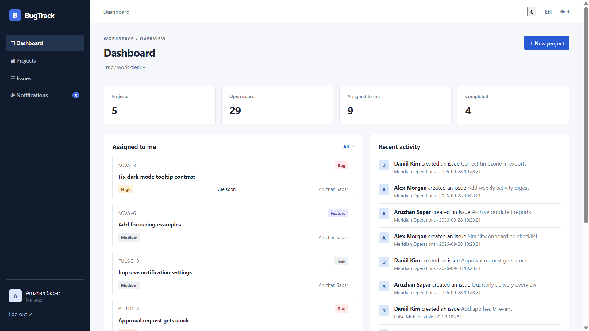
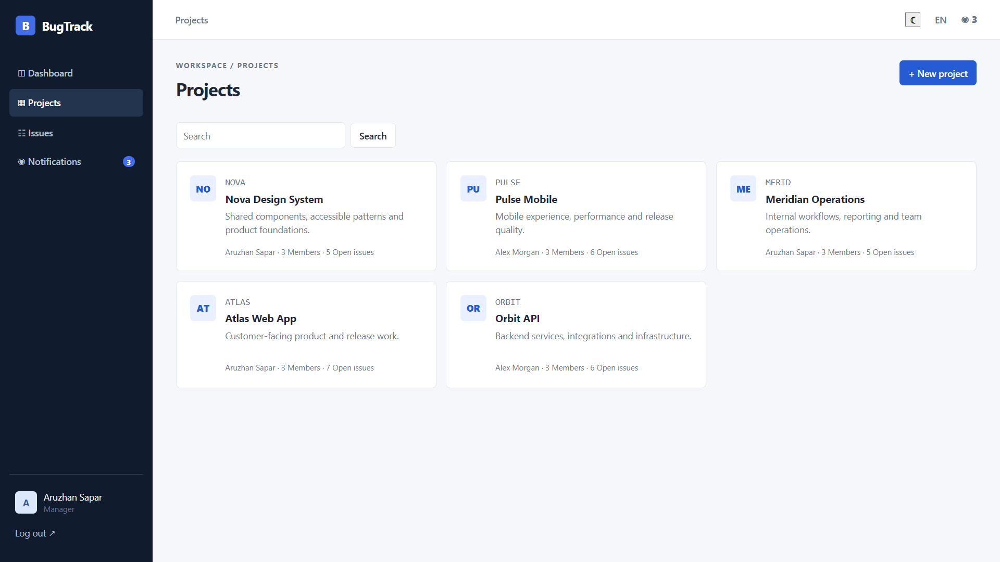
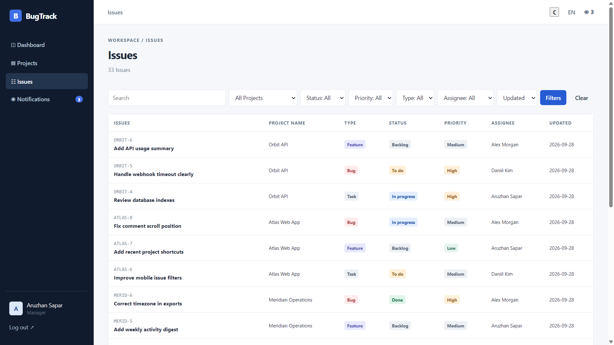
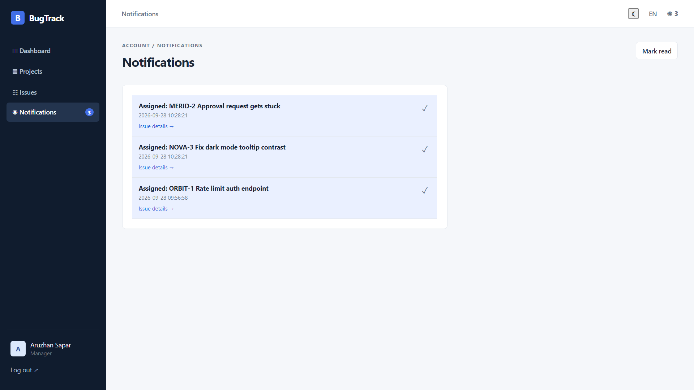

# BugTrack — Day 009

BugTrack is a local PHP and MySQL project and issue tracker. It uses PHP 8.1+, PDO, sessions, HTML, CSS, and vanilla JavaScript. It does not require a framework, Composer, or a build step.

## Features

- Admin, Manager, and Member roles with project-level access controls
- Projects, members, issues, labels, due dates, comments, activity history, and in-app notifications
- Kanban board with drag-and-drop, instant search, and a keyboard- and touch-friendly status menu
- Issue search, filters, sorting, and pagination
- English, Kazakh, and Russian interface localization
- Light and dark themes, including a quick theme control in the header
- Responsive layouts, subtle motion, and support for `prefers-reduced-motion`
- Issue link copying, due-soon and overdue markers, and comment editing and deletion
- CSRF protection, password hashing, server-side validation, output escaping, and PDO prepared statements

## Requirements

- PHP 8.1 or newer with `pdo_mysql` and `mbstring`
- MySQL 8+ or MariaDB 10.5+
- OSPanel/OpenServer or another Apache/PHP/MySQL stack

## Install and run

1. Put the `BugTrack` folder in your OSPanel domain directory. A common setup is `C:\OSPanel\domains\BugTrack`.
2. In OSPanel, set the local domain document root to the `BugTrack` folder and start the web and database services.
3. In phpMyAdmin, import `install.sql`. It creates the `bugtrack` database, schema, initial demo accounts, two projects, and eight issues. If the database user cannot create databases, create `bugtrack` first, remove the `CREATE DATABASE` and `USE` lines at the top of the SQL file, then import it into that database.
4. Copy `config.example.php` to `config.php`. Enter your local database host, port, database name, username, and password. Leave `base_url` empty for a dedicated local domain. For a subfolder URL such as `http://localhost/BugTrack/`, set it to `/BugTrack`.
5. Open the local domain configured in OSPanel.

## Expand the demo data

Import `demo-extra.sql` after `install.sql` to add three more projects and 25 issues, along with labels, comments, activity, and notifications. The script is safe to run again and will not duplicate those demo records. For an existing BugTrack database, import only `demo-extra.sql`; keep the existing `config.php`.

## Demo accounts

| Role | Email | Password |
| --- | --- | --- |
| Admin | `admin@bugtrack.test` | `Demo12345!` |
| Manager | `manager@bugtrack.test` | `Demo12345!` |
| Member | `member@bugtrack.test` | `Demo12345!` |

These shared demo credentials are for local evaluation. Change the passwords before using the app with real data. New registrations receive the Member role. A project manager can add registered users to a project by email.

## Suggested manual checks

1. Sign in with each role and compare the projects and actions available.
2. Create a project as a Manager, add a member, and create a label.
3. Create an issue with a type, priority, assignee, due date, and label. Edit it and add a comment.
4. Move an issue on the board by dragging it and by using its status menu. Reload to confirm the status was saved.
5. Try board search, issue filters, sorting, and pagination. Check in-app notifications after assigning an issue or adding a comment.
6. Switch languages and themes. Check a narrow/mobile viewport and the reduced-motion system preference.
7. Register a new account and confirm it cannot access a project until a manager adds it.

## Screenshots

### Dashboard

### Projects

### Issue list

### Notifications

## Security notes

All state-changing forms require CSRF tokens. Passwords use `password_hash` and `password_verify`. Database operations use PDO prepared statements, and user-provided text is escaped in views. Session cookies are HTTP-only and SameSite Lax. Keep `config.php` private and use HTTPS before making the app available beyond localhost.
